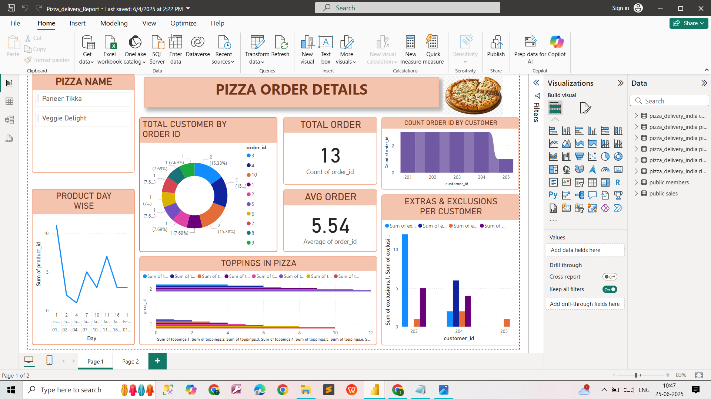

## Pizza Delivery Analysis  

**Problem Statement**  
Analyze pizza delivery operations and sales to derive business insights:  
- Customer ordering behavior  
- Rider performance  
- Popular pizza recipes and toppings  
- Order cancellations  
- Time-based trends in sales and deliveries  

**Dataset**  
- `dataset/PizzaDeliveryData.txt` → Contains table creation scripts and sample data (**schema + INSERT statements**) for orders, customers, riders, pizzas, and deliveries.  

**Questions**  
- A set of analytical questions is listed in [`questions.md`](PizzaQuestions.md).  

**Solutions**  
- SQL query solutions are available in [`solutions.sql`](pizzasolution.sql).  

**Dashboard (Power BI)**  
  

Power BI file for this case study is available here:  
[Pizza_Delivery_Dashboard](Dashboard/Pizza_delivery_Report.pbix)

---
